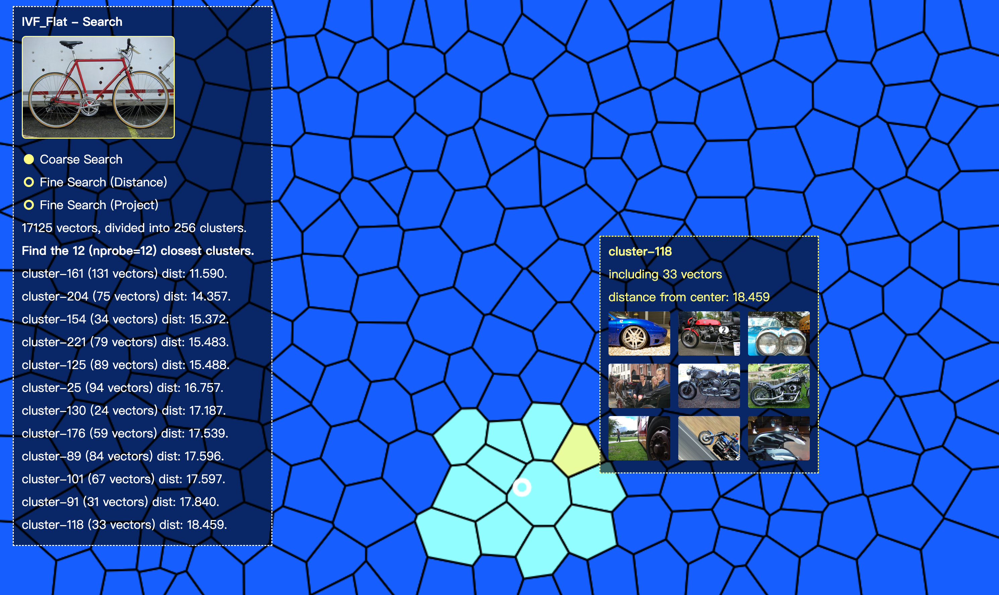
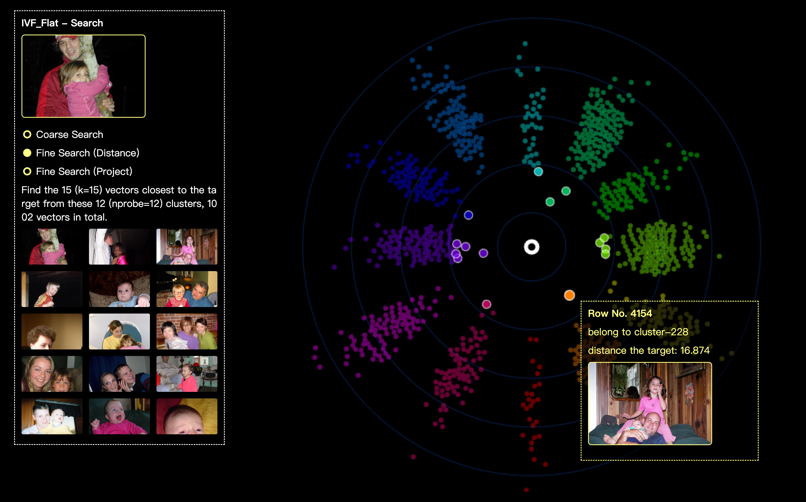
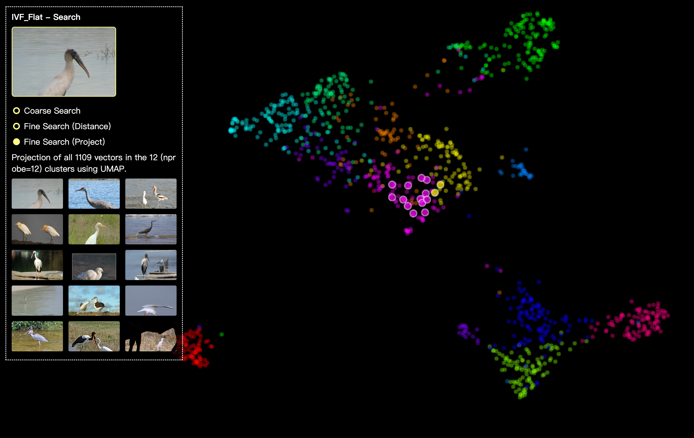

# Feder

## What is feder

Feder is an javascript tool that built for understanding your embedding vectors, feder visualizes faiss, hnswlib and other anns index files, so that we can have a better understanding of anns and high dimensional vectors.

So far, we are focusing on the index from Faiss (only ivf_flat) and HNSWlib (hnsw), we will cover more index types later. which index do you prefer?

Feder is written in **javascript**, and we also provide a python library **federpy**, which is based on federjs.

> **_NOTE:_**

- In IPython environment, it supports users to generate the corresponding visualization directly.
- In other environments, it supports outputting visualizations as html files, which can be opened by the user through the browser with web service enabled.

### Wiki

- [Usage](https://github.com/zilliztech/feder/wiki)

### Online Demos

- [Javascript example (Observable)](https://observablehq.com/@min-tian/feder)
- [Jupternotebook example (Colab)](https://colab.research.google.com/drive/12L_oJPR-yFDlORpPondsqGNTPVsSsUwi#scrollTo=N3qqBAYxYcbt)

### HNSW visualization screenshots


### IVF_Flat visualization screenshots





## Quick Start

### Installation

Use npm or yarn.

```shell
yarn install @zilliz/feder
```

### Material Preparation

Make sure that you have built an index and dumped the index file by Faiss or HNSWlib.

### Init Feder

Specifying the dom container that you want to show the visualizations.

```js
import { Feder } from '@zilliz/feder';

const feder = new Feder({
  filePath: 'faiss_file', // file path
  source: 'faiss', // faiss | hnswlib
  domSelector: '#container', // attach dom to render
  viewParams: {}, // optional
});
```

### Visualize the index structure.

- HNSW - Feder will show the top-3 levels of the hnsw-tree.
- IVF_Flat - Feder will show all the clusters.

```js
feder.overview();
```

### Explore the search process.

Set search parameters (optional) and Specify the query vector.

```js
feder
  .setSearchParams({
    k: 8, // hnsw, ivf_flat
    ef: 100, // hnsw (ef_search)
    nprobe: 8, // ivf_flat
  })
  .search(target_vector);
```

## Examples

We prepare a simple case, which is the visualizations of the `hnsw` and `ivf_flat` with 17,000+ vectors that embedded from [VOC 2012](http://host.robots.ox.ac.uk/pascal/VOC/voc2012/VOCtrainval_11-May-2012.tar)).

Only need enable a web service.

```shell
git clone git@github.com:zilliztech/feder.git
cd test
python -m http.server
```

Then open http://localhost:8000/

It will show 4 visualizations:
- `hnsw` overview
- `hnsw` search view
- `ivf_flat` overview
- `ivf_flat` search view

## Pipeline - explore a new dataset with feder

### Step 1. Dataset preparation

Put all images to **test/data/images/**. (example dataset [VOC 2012](http://host.robots.ox.ac.uk/pascal/VOC/voc2012/VOCtrainval_11-May-2012.tar))

You can also generate random vectors without embedding for index building and skip to **step 3**.

### Step 2. Generate embedding vectors

Recommend to use [towhee](https://github.com/towhee-io/towhee), one line of code to generating embedding vectors!

We have the [encoded vectors](https://assets.zilliz.com/voc_vectors_e8ec5a5eae.csv) ready for you.

### Step 3. Build an index and dump it.

You can use [faiss](https://github.com/facebookresearch/faiss) or [hnswlib](https://github.com/nmslib/hnswlib) to build the index.

(\*Detailed procedures please refer to their tutorials.)

Referring to **test/data/gen_hnswlib_index_\*.py** or **test/data/gen_faiss_index_\*.py**

Or we have the [index file](https://assets.zilliz.com/hnswlib_hnsw_voc_17k_1f1dfd63a9.index) ready for you.

### Step 4. Init Feder.

```js
import { Feder } from '@zilliz/feder';
import * as d3 from 'd3';

const domSelector = '#container';
const filePath = [index_file_path];

const mediaCallback = (rowId) => mediaUrl;

const feder = new Feder({
  filePath,
  source: 'hnswlib',
  domSelector,
  viewParams: {
    mediaType: 'img',
    mediaCallback,
  },
});
```

If use the random_data, **no need** to specify the mediaType.

```js
import { Feder } from '@zilliz/feder';
import * as d3 from 'd3';

const domSelector = '#container';
const filePath = [index_file_path];

const feder = new Feder({
  filePath,
  source: 'hnswlib',
  domSelector,
});
```

### Step 5. Explore the index!

Visualize the overview

```js
feder.overview();
```

or visualize the search process.

```js
feder.search(target_vector[, targetMediaUrl]);
```

or randomly select an vector as the target to visualize the search process.

```js
feder.searchRandTestVec();
```

More cases refer to the **test/test.js**

## Blogs

- [Visualize Your Approximate Nearest Neighbor Search with Feder](https://zilliz.com/blog/Visualize-Your-Approximate-Nearest-Neighbor-Search-with-Feder)
- [Visualize Reverse Image Search with Feder](https://zilliz.com/blog/Visualize-Reverse-Image-Search-with-Feder)

## Roadmap

We're still in the early stages, we will support more types of anns index, and more unstructured data viewer, stay tuned.

## Acknowledgments

- [faiss](https://github.com/facebookresearch/faiss)
- [hnswlib](https://github.com/nmslib/hnswlib)
- [d3](https://github.com/d3/d3)
